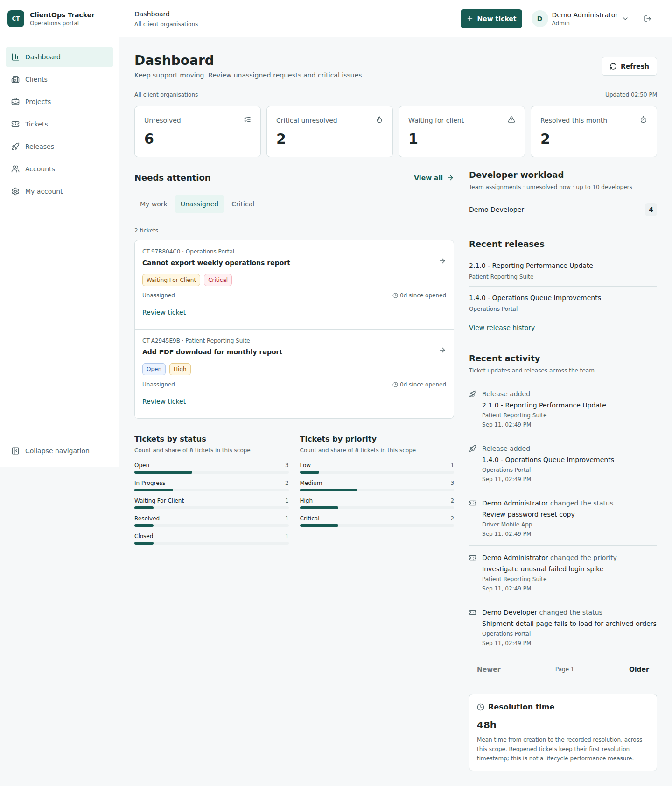

# ClientOps Tracker

[](https://github.com/EdenCirakoglu/Client-Tracker/actions/workflows/ci.yml)
[](LICENSE)

Open-source support and delivery operations platform for small software teams.

Manage client projects, support tickets, comments, releases, and advisory rule-based triage through a role-aware Next.js dashboard and an Express REST API backed by PostgreSQL and Drizzle.

Connect requests to agreed outcomes, named delivery owners, target dates, release-linked
delivery and explicit client acceptance. Scope approvals refer to a specific revision;
staff preview progress summaries before publishing them to the client portal.

## Open Source and Paid Services

The code remains [MIT-licensed](LICENSE): commercial use, modification and redistribution are permitted with the required notices. You do not need to buy a service to use or self-host the public code.

Start with **assisted installation**: a scoped private deployment, configuration, branding and onboarding. Payment is for delivery expertise and an agreed service, not exclusive repository access.

[Book a demo](clientops-tracker/docs/SERVICES.md#book-a-demo) | [Buy installation](clientops-tracker/docs/SERVICES.md#buy-installation)

Booking and checkout are **not yet configured**. These links currently explain the proposed services; no purchase or booking can be completed here. Managed hosting comes after real operational acceptance. [Service options and sales setup](clientops-tracker/docs/MONETISATION.md) explain the separate roles of purchases, optional sponsorship and a future GitHub Marketplace integration.



- [Project guide and local setup](clientops-tracker/README.md)
- [Engineering summary](clientops-tracker/PROJECT_SUMMARY.md)
- [Architecture](clientops-tracker/docs/ARCHITECTURE.md)
- [API reference](clientops-tracker/docs/API.md)
- [Agency delivery workflows](clientops-tracker/docs/PRODUCT_WORKFLOWS.md) and [delivery planning](clientops-tracker/docs/DELIVERY_PLANNING.md)
- [Buyer-facing installation and acceptance guide](clientops-tracker/docs/INSTALLATION_GUIDE.md)
- [Secure sessions and account setup](clientops-tracker/docs/SESSION_HARDENING.md)
- [Role-based operations UI and verification](clientops-tracker/docs/UI_REFINEMENT.md)
- [Deployment guide](clientops-tracker/docs/DEPLOYMENT.md)
- [Release verification evidence](clientops-tracker/docs/RELEASE_READINESS.md)
- [Usability and operator-control review evidence](clientops-tracker/docs/FOLLOWUP_READINESS.md)
- [PR #5 release-candidate and staging handoff](clientops-tracker/docs/RELEASE_CANDIDATE.md)
- [Screenshots](clientops-tracker/docs/SCREENSHOTS.md)
- [Contributing](clientops-tracker/CONTRIBUTING.md) and [security policy](clientops-tracker/SECURITY.md)

## Repository Layout

```text
.github/workflows/       # GitHub-discoverable CI, image publication and manual deployment
clientops-tracker/       # pnpm workspace; run application commands here
  apps/web/             # Next.js App Router / TypeScript
  apps/api/             # Express / Drizzle / PostgreSQL / Vitest
  docs/                 # Architecture, operations and verification evidence
```

```powershell
git clone https://github.com/EdenCirakoglu/Client-Tracker.git
cd Client-Tracker/clientops-tracker
pnpm install --frozen-lockfile
```

Continue with the [local setup](clientops-tracker/README.md). Public hosting is a separate step: this repository does not claim a live deployment or a passing hosted workflow without an actual run.
