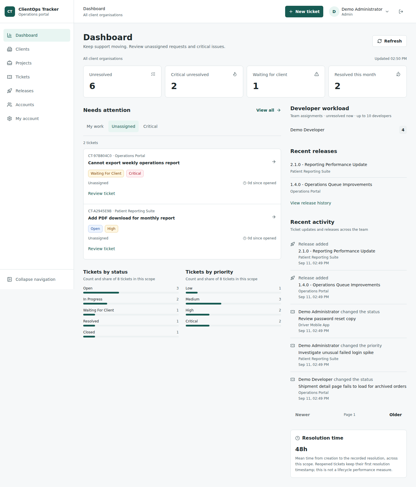
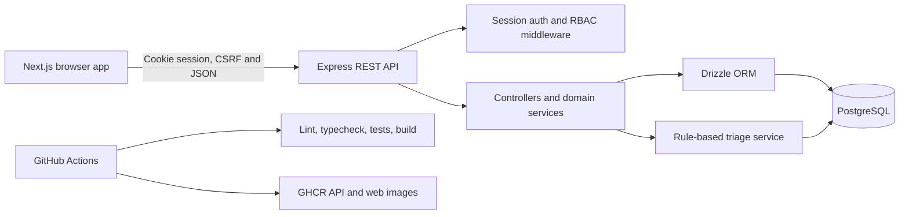
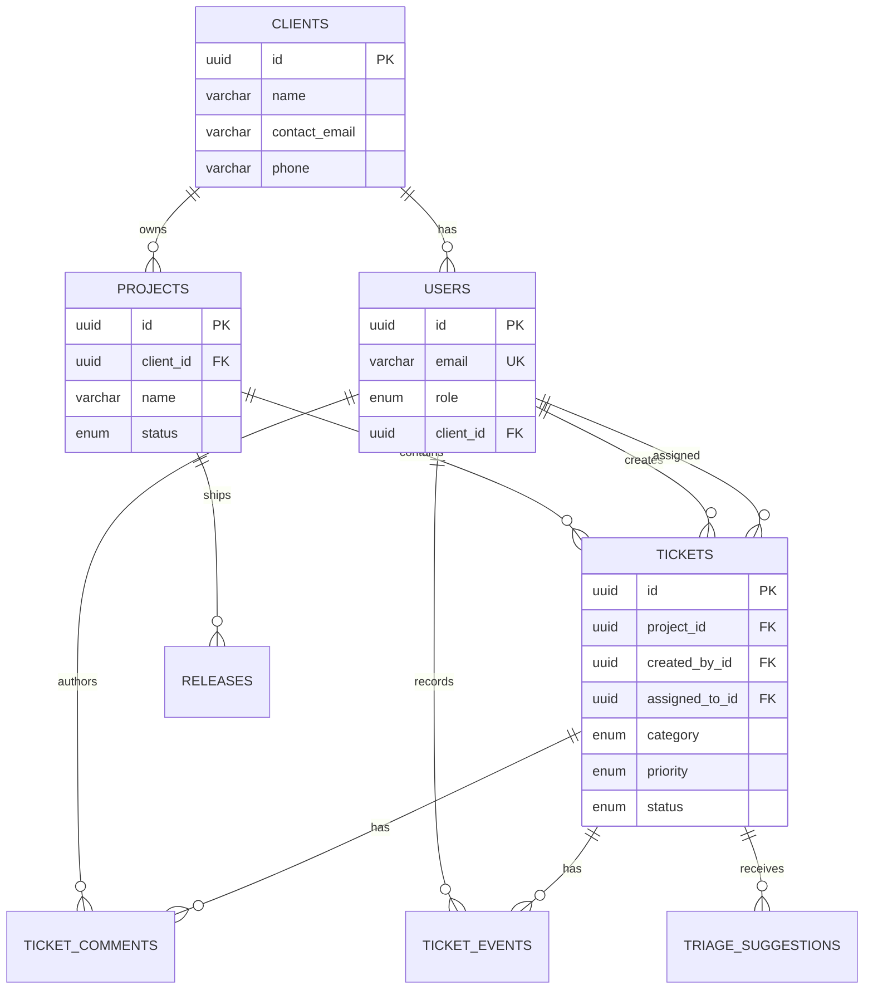
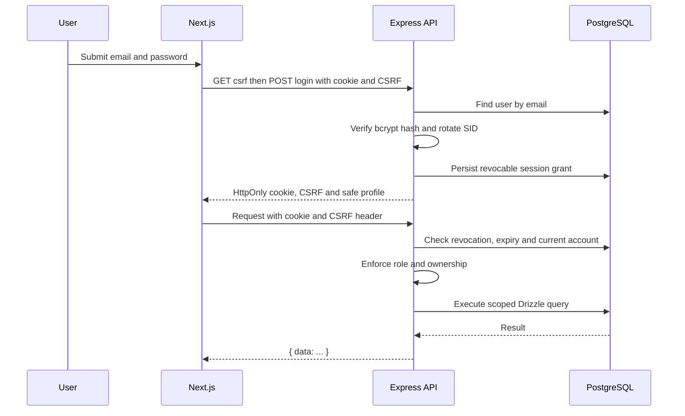

# ClientOps Tracker

[](https://github.com/EdenCirakoglu/Client-Tracker/actions/workflows/ci.yml)
[](LICENSE)

ClientOps Tracker is an open-source support and delivery operations platform for small software teams. It brings client context, projects, support tickets, releases, operational metrics, and assisted triage into one workflow.

> See [screenshots](docs/SCREENSHOTS.md) and [release verification evidence](docs/RELEASE_READINESS.md). Local verification, hosted CI and public deployment are reported separately.



## Why ClientOps Tracker

Small software teams often split client requests between email, chat, spreadsheets, and issue trackers. That makes ownership, visibility, and delivery history difficult to maintain. ClientOps Tracker provides a focused portal where internal teams and clients can work from the same operational record while seeing only the data appropriate to their role.

## Features

- Revocable PostgreSQL sessions, HttpOnly cookies, CSRF protection, administrator invitations and password recovery.
- Role-based access control for administrators, developers, and clients.
- Client, project, ticket, comment, release, and dashboard workflows.
- PostgreSQL persistence with Drizzle ORM migrations and relations.
- Zod request validation and centralized API error handling.
- Swagger/OpenAPI documentation for the REST API.
- Rule-based ticket triage that suggests category, priority, summary, next action, and a heuristic rule-match score.
- Advisory triage application with ticket event history.
- Role-specific work queues, linked metrics and private activity from the real Express API.
- Responsive, collapsible navigation and Light/Dark/System themes across portal and account screens.
- Vitest/Supertest API tests plus real-container Playwright journeys and axe accessibility checks.
- Docker Compose development setup and production container definitions.
- GitHub Actions CI and GitHub Container Registry image publishing.

## Architecture



The monorepo keeps the browser application and API independently deployable while sharing tooling. The Git root is one directory above this workspace: GitHub workflows live in `../.github/workflows/`, and the repository landing page is `../README.md`.

```text
Client-Tracker/                 # Git repository root (local folder name may differ)
  .github/
    workflows/
      ci.yml
      docker.yml
      deploy.yml
  README.md                    # GitHub landing page
  clientops-tracker/            # pnpm workspace
    apps/
      api/
        drizzle/
        src/
        tests/
        Dockerfile
        package.json
        .env.example
      web/
        src/
        Dockerfile
        package.json
        .env.example
    docs/
    e2e/
    nginx/
    docker-compose.yml
    docker-compose.prod.yml
    package.json
    pnpm-workspace.yaml
    README.md                  # This detailed guide
```

### Database model



### Request and authentication flow



## Technology Stack

- Frontend: Next.js App Router, React, TypeScript, Tailwind CSS
- Backend: Express.js, TypeScript, Zod, Helmet, CORS
- Database: PostgreSQL 16
- ORM: Drizzle ORM and Drizzle Kit
- Testing: Vitest, Supertest, Playwright and axe-core
- Tooling: pnpm workspaces, ESLint, Prettier, tsup
- Delivery: Docker, Docker Compose, GitHub Actions, GHCR

## Local Development

### Prerequisites

- Node.js 24 LTS (Node 20 is end-of-life)
- pnpm 9.15.4
- Docker Desktop running

Install the pinned package manager if needed (use `npm.cmd` / `pnpm.cmd` in PowerShell if execution policy blocks `.ps1` wrappers):

```bash
npm install --global pnpm@9.15.4
```

Install dependencies:

```bash
pnpm install
```

Run these commands inside `clientops-tracker/`, not the Git root. Create environment files only if absent; review existing values instead of overwriting local configuration:

```bash
test -f apps/api/.env || cp apps/api/.env.example apps/api/.env
test -f apps/web/.env.local || cp apps/web/.env.example apps/web/.env.local
```

On Windows PowerShell:

```powershell
if (!(Test-Path apps/api/.env)) { Copy-Item apps/api/.env.example apps/api/.env }
if (!(Test-Path apps/web/.env.local)) { Copy-Item apps/web/.env.example apps/web/.env.local }
```

Start PostgreSQL, apply the schema, and add local sample data:

```powershell
pnpm db:up
pnpm db:migrate
$env:SEED_RESET='true'
pnpm db:seed
Remove-Item Env:SEED_RESET
```

Start both applications:

```powershell
pnpm dev
```

Run them separately when needed:

```powershell
pnpm dev:api
pnpm dev:web
```

Local URLs:

- Web: http://localhost:3000
- API: http://localhost:8080
- Health: http://localhost:8080/health
- Swagger: http://localhost:8080/api/docs

With the production Compose stack, Nginx is the only public entry point:

- Frontend: `https://your-domain.example`
- API health: `https://your-domain.example/api/health`
- API docs: `https://your-domain.example/api/docs`

Seed resets require `DISPOSABLE_DATABASE_NAME` to exactly match a `clientops_*demo` or `clientops_*test` database and `SEED_RESET=true`; production mode is rejected. The default development database is now `clientops_demo`. Existing `clientops_tracker` data is preserved, not automatically migrated or reset. If the old `clientops-postgres` container occupies 5432, stop it deliberately before starting a new demo container, or use the isolated stack below on port 8180.

## Demo Accounts

These accounts are fake local demonstration accounts only:

```text
admin@example.com     / password123 / ADMIN
developer@example.com / password123 / DEVELOPER
client@example.com    / password123 / CLIENT (Northstar)
bluewave@example.com  / password123 / CLIENT (Bluewave)
```

Do not use these credentials in a hosted environment. Demo login requires `DEMO_MODE=true`, a designated disposable database and a loopback origin; otherwise the server rejects these accounts. The additive migration marks legacy seed accounts as demo identities. Production startup never seeds users. Use the [one-time bootstrap and invitation runbook](docs/SESSION_HARDENING.md) for non-demo account setup.

## API

The API uses JSON responses with a consistent envelope:

```json
{ "data": {} }
```

Errors use an `error` object with a stable code and message. Browsers use credentialed fetch and an HttpOnly cookie. Unsafe requests also send:

```text
X-CSRF-Token: <token from GET /api/auth/csrf>
```

Swagger/OpenAPI is available at `/api/docs`. Endpoint details and curl examples are in [docs/API.md](docs/API.md).

Main route groups:

- Authentication: `/api/auth`
- Administrator-controlled accounts: `/api/users`
- Clients: `/api/clients`
- Projects: `/api/projects`
- Tickets and comments: `/api/tickets`
- Releases: `/api/releases`
- Dashboard metrics and activity: `/api/dashboard/metrics`, `/api/dashboard/activity`
- Bounded ticket filtering and pagination: `/api/tickets/queue`
- Health: `/health`

## Roles

- `ADMIN`: full access, including client, project, and release administration.
- `DEVELOPER`: operational read access, ticket updates, comments, and triage actions.
- `CLIENT`: access to their own client, projects, tickets, releases, and public comments.

Authorization is enforced by the API. Frontend navigation is also adapted by role for a clearer user experience.

## Rule-Based Assisted Triage

Ticket creation generates an advisory triage suggestion without overwriting the user's selected category or priority. Internal users can refresh or apply a suggestion through the API and dashboard.

The saved suggestion is loaded from PostgreSQL when an internal user opens or refreshes a ticket. Pending and applied states remain visible across sessions. Applying it locks the ticket and commits the classification, acceptance and history event together; repeating an accepted suggestion does not change the ticket or add an event.

The displayed score is a fixed heuristic rule-match score, not a validated probability. No live LLM is connected. A future provider can implement the same evaluation boundary. Clients never receive internal suggestions, internal history, operational workload or internal comments, including in ticket-creation responses.

## Database Workflow

```powershell
pnpm db:generate
pnpm db:migrate
$env:SEED_RESET='true'
pnpm db:seed
Remove-Item Env:SEED_RESET
pnpm db:studio
```

See [docs/DATABASE.md](docs/DATABASE.md) for the schema and relationship model.

## Docker

For local PostgreSQL only:

```powershell
pnpm db:up
pnpm db:down
```

For an isolated local production-style demonstration:

```powershell
pnpm verify:stack
```

Open https://localhost:8443/login (disposable demo) or https://localhost:8444/login (non-demo account fixture). These use local self-signed certificates, never public trust. The script creates separate named volumes, upgrades an old populated fixture without reseeding and bootstraps only the empty account fixture. OpenSSL is required; Windows defaults to Git for Windows' OpenSSL. Requirements, fictional owner credentials and local Mailpit URLs are in [SESSION_HARDENING.md](docs/SESSION_HARDENING.md). No production deployment is claimed.

## Quality Checks

Tests require a separate disposable PostgreSQL database; there is no development
or production URL fallback. Copy the example only if the local test file does not exist:

```powershell
if (!(Test-Path apps/api/.env.test)) { Copy-Item apps/api/.env.test.example apps/api/.env.test }
pnpm db:test:up
```

```powershell
pnpm lint
pnpm typecheck
pnpm test
pnpm build
pnpm format:check
docker compose config --quiet
docker compose -f docker-compose.prod.yml --env-file .env.production.example config --quiet
```

Root GitHub workflows run application checks, migration, isolated tests, Compose image builds and browser/accessibility scenarios. See [revision-specific results](docs/RELEASE_READINESS.md) for actual hosted evidence, separate from local checks. Image publishing requires successful main CI for the same full commit SHA. The optional manual DigitalOcean workflow requires an approved production environment.

API tests and browser tests are separate commands. Tests require the dedicated security-test cluster and local Mailpit; update existing `.env.test` values from the example without overwriting unrelated settings. See [hardening verification](docs/SESSION_HARDENING.md) and [UI refinement](docs/UI_REFINEMENT.md) for all nine browser scenarios, exact commands and report locations. [Earlier browser evidence](docs/BROWSER_TESTS.md) remains revision-specific.

For browser checks against the isolated stack (these create fictional records):

```powershell
pnpm exec playwright install chromium
$env:E2E_ALLOW_DISPOSABLE_DEMO='true'
pnpm test:e2e
Remove-Item Env:E2E_ALLOW_DISPOSABLE_DEMO
```

On this Windows machine the verified run used installed Chrome in a fresh profile:
set `$env:BROWSER_CHANNEL='chrome'` instead of downloading Chromium. Use only
the designated disposable fixtures; existing development and older verification databases are not reset.

See [deployment troubleshooting](docs/DEPLOYMENT.md) for Docker TLS inspection errors. Never disable certificate verification.

## Security

Passwords are hashed with bcryptjs. API requests use server-revocable HttpOnly cookie sessions, synchronizer CSRF tokens, role/ownership checks, Zod, Helmet and exact-origin CORS. Idle/absolute expiry, password-reset revocation and account disablement are server-enforced. PostgreSQL-backed rate limits cover authentication and recovery. No JWT/localStorage authentication remains.

Read [SECURITY.md](SECURITY.md) for vulnerability reporting and [docs/SECURITY.md](docs/SECURITY.md) for the technical security model.

## Deployment Readiness

The project includes Dockerfiles, HTTPS production Compose configuration, GHCR publishing and a manual DigitalOcean workflow. Public deployment has not been performed. Launch still requires production TLS certificates/renewal, domain, secrets, SMTP sender verification, backups/restore drills, monitoring and an operational release policy. Secure account provisioning is implemented but real accounts and email services are not configured by local verification.

See [docs/DEPLOYMENT.md](docs/DEPLOYMENT.md) and [PROJECT_SUMMARY.md](PROJECT_SUMMARY.md).

## Roadmap and Future Business Models

Product and engineering improvements are tracked in [docs/ROADMAP.md](docs/ROADMAP.md). Realistic future models are described in [docs/MONETISATION.md](docs/MONETISATION.md), including hosted SaaS, paid deployment/customisation, premium features, and an agency client-portal template.

## Contributing

Read [CONTRIBUTING.md](CONTRIBUTING.md) before opening an issue or pull request. Contributions should include focused changes, relevant tests, documentation updates, and verification details.

## License

ClientOps Tracker is released under the [MIT License](LICENSE).
