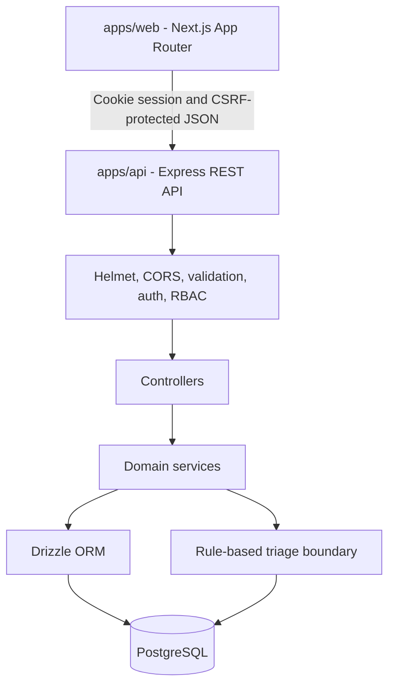

# Architecture

ClientOps Tracker is a pnpm monorepo with a browser application, an HTTP API, and a relational database. Each runtime has a clear responsibility while root scripts and quality tooling keep local development consistent.

## Components

### Web application

`apps/web` provides dashboard, login, account setup/recovery, role-aware navigation and operational workflows. Its API client reads `NEXT_PUBLIC_API_URL`, uses credentialed fetch and in-memory synchronizer CSRF tokens, and converts API errors into typed frontend errors. No JWT is stored or attached.

### API application

`apps/api` owns authentication, authorization, validation, request handling, domain services, OpenAPI documentation, and database access. Routes are thin and delegate business behavior to controllers and services.

### Database

PostgreSQL is the source of truth for users, client ownership, projects, tickets, comments, ticket events, releases, and triage suggestions. Drizzle ORM provides typed queries and Drizzle Kit manages migrations.

## Request Flow

1. The browser calls Express with JSON and an HttpOnly SID cookie; unsafe requests include a CSRF header.
2. Express applies security headers, CORS, JSON parsing, authentication, and role checks.
3. Zod validates request bodies and route parameters.
4. Controllers call services for authorization-aware database operations.
5. Drizzle executes parameterized PostgreSQL queries.
6. The API returns `{ "data": ... }` on success or a structured `error` object.

## Authentication Flow

Login verifies bcrypt and active/demo eligibility, rotates the SID and CSRF token,
and creates a PostgreSQL authorization grant. Every protected request checks server
idle/absolute expiry, revocation and current user version, role and organisation.
Logout, password changes and administrative access changes revoke sessions.
See [security model](SECURITY.md) for concurrency semantics, cookie policy and limits.
Accounts are created by a one-time operator bootstrap or administrator invitation;
expiring token hashes and atomic consumption keep recovery separate from login.

## RBAC and Ownership

- `ADMIN` can manage all operational resources.
- `DEVELOPER` can view operational data, update tickets, create comments, and generate or apply triage suggestions.
- `CLIENT` can access only their own client, projects, tickets, releases, and public comments. Ticket creation is limited to their own projects.

Role checks and ownership filters are enforced in the API. Frontend navigation mirrors those rules for usability but is not treated as a security boundary.

## Triage Boundary

The triage service evaluates text with deterministic rules and persists a suggestion.
The pure `evaluateTicketTriage` function is the provider boundary; no network LLM
call is made. Its score is a heuristic rule-match score, not a probability.
Internal ticket detail loads the saved suggestion and history from PostgreSQL.
Generation and application lock the ticket row; application commits category,
priority, acceptance and one history event in the same transaction. Reapplying an
accepted suggestion is a no-op, including after later manual ticket edits.

Client responses omit operational workload, triage and internal history at the
service layer. Public comments and ownership-filtered project/ticket/release data
remain available. Display-name projections never return password hashes.

## Delivery

The actual Git root contains `.github/workflows/`, while the pnpm workspace is
nested under `clientops-tracker/`. CI is configured to run checks against a separate
disposable PostgreSQL cluster. Image publication requires passing CI for the same
commit. Production Compose uses same-origin Nginx routing and container-executed
migrations. Manual deployment is gated by an operator-configured production
environment. Exact hosted CI results are recorded in [release evidence](RELEASE_READINESS.md); public deployment remains unperformed.
