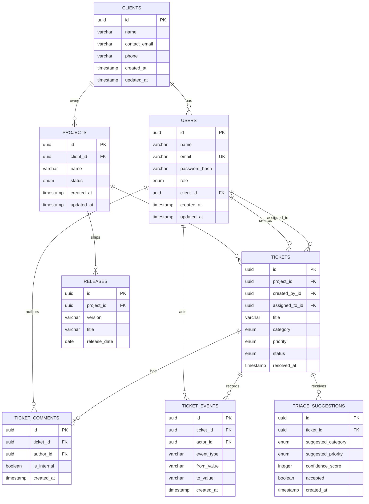

# Database

ClientOps Tracker uses PostgreSQL with Drizzle ORM. The database is the source of truth for operational state and history.

## Entity Relationship Diagram



## Tables and Relationships

- `clients` is the tenant-like ownership record for external organisations.
- `users` contains internal users and client users. `client_id` is nullable for internal staff.
- `projects` belong to clients and provide the scope for tickets and releases.
- `tickets` belong to projects and track creator, optional assignee, workflow status, category, priority, and resolution time.
- `ticket_comments` stores public and internal conversation entries.
- `ticket_events` is an append-only style history of ticket workflow changes and triage application.
- `releases` records versioned project delivery milestones.
- `triage_suggestions` stores advisory classification results separately from the ticket's final decision.

Foreign keys use restrictive or cascading behavior appropriate to ownership and history. Email is unique, project versions are unique within a project, and triage confidence is constrained to `0..100`.

## Why Drizzle ORM

Drizzle keeps schema definitions close to TypeScript types, provides composable SQL-like queries, and makes relationships and constraints visible in source control. Drizzle Kit generates reviewed SQL migrations. The Drizzle runtime migrator applies the same journal from source, CI or the API container without requiring development dependencies in production.

## Database Commands

```bash
pnpm db:generate
pnpm db:migrate
pnpm db:studio
```

## Disposable Data Only

Tests require `TEST_DATABASE_URL` and `DISPOSABLE_DATABASE_NAME` matching a dedicated
`clientops_*test` database. Missing or unsafe configuration fails before fixtures
run. `docker-compose.test.yml` uses a separate PostgreSQL cluster and tmpfs storage
on loopback port 55433. There is no development `.env` fallback.

The fictional demo contains two organisations, four demo users (one client for each
organisation), three projects, eight tickets, comments, events, two releases and
three pending suggestions. Creator ownership and resolution timestamps are coherent.
Names/content are repeatable; UUIDs regenerate and dates are relative to the seed day.

Seed resets require `NODE_ENV` other than production, `SEED_RESET=true`, and an exact
`DISPOSABLE_DATABASE_NAME` designation matching a `clientops_*demo` or `clientops_*test`
database. The original `clientops_tracker` database is not reset. See the explicit
commands in [the README](../README.md) and [deployment guide](DEPLOYMENT.md).

`pnpm --filter @clientops/api db:fingerprint` performs a read-only, repeatable-read
snapshot and prints only per-table row counts and a SHA-256 content fingerprint.
It can demonstrate that running tests leaves demo data unchanged without exposing rows.
